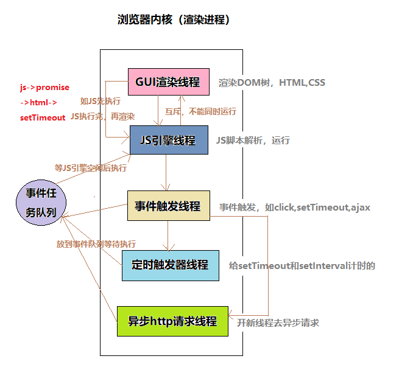

# 浏览器内核 - Rendering Engine(渲染引擎)

## 介绍

* 负责对网页语法的解释（如标准通用标记语言下的一个应用HTML、JavaScript）并渲染（显示）网页

* 对网页编写语法的解释也有不同，因此同一网页在不同的内核的浏览器里的渲染（显示）效果也可能不同

* 主要包括以下三个技术分支：排版渲染引擎、 `JavaScript` 引擎，以及其他

* 现时主要的四大排版引擎为：`Trident`（应用于Internet Explorer）；`Gecko`（应用于Mozilla Firefox）；`Blink`（应用于Chrome ）；`WebKit`（应用于Apple Safari和早期版本的Google Chrome

<table>
<tbody>
<tr>
<td>内核</td>
<td>是否开源</td>
<td>插件支持</td>
<td>应用浏览器</td>
<td>支持操作系统</td>
</tr>
<tr>
<td>Trident</td>
<td>否，但提供接口调用</td>
<td>ActiveX</td>
<td>IE</td>
<td>Windows</td>
</tr>
<tr>
<td>Gecko</td>
<td>是，多种协议授权发行，包括MPL、GPL、LGPL</td>
<td>NPAPI</td>
<td>Firefox</td>
<td>Windows,Mac,Linux/BSD</td>
</tr>
<tr>
<td>Blink</td>
<td>是</td>
<td>NPAPI</td>
<td>Chrome，Opera</td>
<td>Windows,Mac,Linux/BSD</td>
</tr>
<tr>
<td>Webkit</td>
<td>是，遵从LGPL协议</td>
<td>NPAPI</td>
<td>Chrome,Safari</td>
<td>Windows,Mac,Linux/BSD</td>
</tr>
</tbody>
</table>

version: `<chrome://version/>`

[参考](https://www.bbsmax.com/A/kmzLxbDXzG/)

## 浏览器进程与线程

* `浏览器是多进程`的，浏览器每一个 `tab` 标签都代表一个独立的进程（也不一定，因为多个空白 `tab` 标签会合并成一个进程）
  * `Browser` 进程 - 浏览器的主进程（负责协调，主控）
  * 第三方插件进程 - 每种类型的插件对应一个进程，仅当使用该插件时才创建
  * `GPU` 进程 - 最多一个，用于3D绘制等
  * 浏览器渲染进程(浏览器内核)

* `浏览器内核是多线程`，在内核控制下各线程相互配合以保持同步，一个浏览器通常由以下常驻线程组成
  * `GUI` 渲染线程
  * `JavaScript` 引擎线程
  * 定时触发器线程
  * 事件触发线程
  * 异步 `http` 请求线程
* `GUI` 渲染线程
  * 负责渲染浏览器界面，`解析 HTML, CSS,构建 DOM 树和 RenderObject 树，布局和绘制`等
  * 当界面需要重绘或由于某种操作引发回流时，该线程就会执行
  * `GUI` 渲染线程与 `JS` 引擎线程是`互斥`的，当 `JS` 引擎执行时 `GUI` 线程会被挂起（相当于冻结了）,`GUI` 更新会被保存在一个队列中等到JS引擎空闲时立即被执行
* `JavaScript` 引擎线程
  * 也称为`JS内核`，负责处理`JavaScript脚本程序`。（例如V8引擎）。
  * `JS` 引擎一直等待着任务队列中任务的到来，然后加以处理，一个 `Tab` 页（`render` 进程）中`无论什么时候都只有一个JS线程在运行JS程序`。
  * `GUI` 渲染线程与 `JS` 引擎线程是互斥的，故当 `JS` 执行的时间过长，会造成页面的渲染不连贯，导致页面渲染加载阻塞
* 事件触发线程
  * `归属于浏览器而不是JS引擎`，用来控制事件循环
  * 当 `JS引擎` 执行代码块如 `setTimeout` 时（也可来自浏览器内核的其它线程，如鼠标点击，AJAX异步请求等），`会将对应任务添加到事件线程中`
  * 当对应的事件符合触发条件被触发时，该线程会把事件添加到待处理队列的队尾，等待 `JS引擎` 的处理
* 定时触发器线程[1](https://developer.mozilla.org/zh-CN/docs/Web/API/Window/setTimeout)
  * `setTimeout` 和 `setInterval` 所在的线程
  * 浏览器定时计数器并不是由 `JavaScript` 引擎计数的,通过单独线程来计时并触发定时（计时完毕后，添加到事件队列中，等待 `JS` 引擎空闲后执行）
  * 最小延时 `>=4ms`
* 异步 `http` 请求线程
  * `XMLHttpRequest` 在连接后是通过浏览器新开一个线程请求
  * 在检测到状态变更时，如果设置有回调函数，异步线程就产生状态变更事件，将这个回调再放入事件队列中，再由 `JavaScript` 引擎执行

* 浏览器内核线程示意图


## CONTINUE
<!-- TODO -->
```JS
setTimeout(
  function () {
    console.log(1)
}, 0);
new Promise((resolve) => {
  console.log(2);
  resolve(3);
  console.log(4)
}).then((res) => {
  console.log(res);
  console.log(5)
});
console.log(6);

// 2
// 4
// 6
// 3
// 5
// <undeined
// 1
```

[参考1](https://www.imweb.io/topic/58e3bfa845e5c13468f567d5)

[参考2](https://segmentfault.com/a/1190000014018604)

## 浏览器的 hack 写法 #TODO

## 浏览器扩展 #TODO