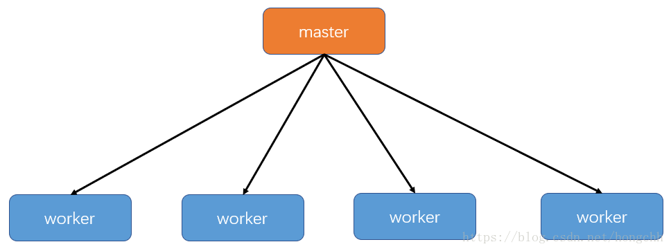
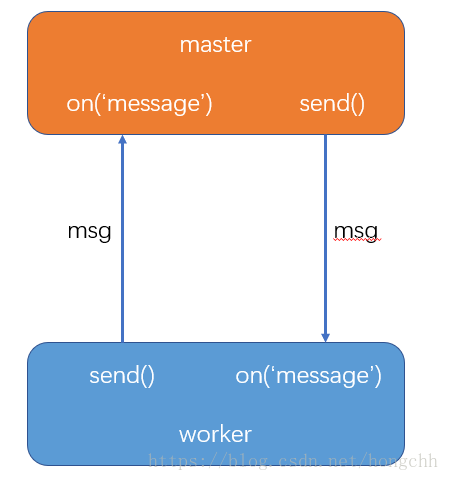
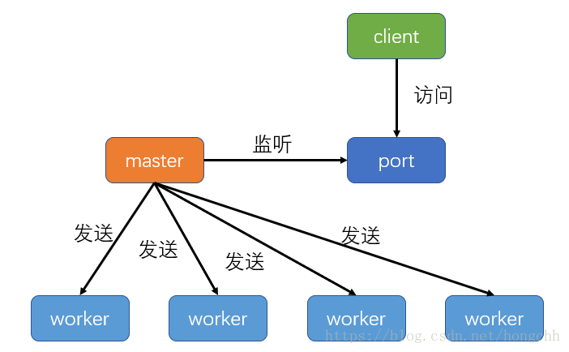

# NODE.JS

## 简介

Node.js 是一个基于 Chrome V8 引擎的 JavaScript 运行时

## 安装

* Ubuntu 安装

```shell
sudo apt install nodejs-legacy
sudo apt-get install npm
```

`npm(Node Package Manager)`

`nvm(Node Version Manager)`

* 查看 node 版本： `node -v`

* 升级 node

```shell
// 清除 npm cache
sudo npm cache clean -f
// 安装 版本管理器 n
sudo npm install n -g
// 安装并使用最新版本 node
sudo n stable
```

## NPM 简介

* 允许用户从NPM服务器下载别人编写的第三方包到本地使用
* 允许用户从NPM服务器下载并安装别人编写的命令行程序到本地使用
* 允许用户将自己编写的包或命令行程序上传到NPM服务器供别人使用

```shell
npm install express          # 本地安装
npm install express -g   # 全局安装
```

## Node.js REPL(交互式解释器)

* 读取 - 读取用户输入，解析输入了Javascript 数据结构并存储在内存中
* 执行 - 执行输入的数据结构
* 打印 - 输出结果
* 循环 - 循环操作以上步骤直到用户两次按下 ctrl-c 按钮退出

### 启动 Node 的终端

```shell
$ node
>
```

* 简单的表达式运算
* 使用变量
* 多行表达式

```js
{}; // ‘...’： 系统自动生成， ‘;’： 退出多行
```

执行 nodejs，`node main.js`

## 同步，异步

* 异步回调

> [demo](./test/io-demo.js)

## Node.js 事件循环

* Node.js 是单进程单线程应用程序，但是因为 V8 引擎提供的异步执行回调接口，通过这些接口可以处理大量的并发，所以性能非常高。
* Node.js 几乎每一个 API 都是支持回调函数的。
* Node.js 基本上所有的事件机制都是用设计模式中观察者模式实现。
* Node.js 单线程类似进入一个while(true)的事件循环，直到没有事件观察者退出，每个异步事件都生成一个事件观察者，如果有事件发生就调用该回调函数.

### Node.js 使用事件驱动模型 & EventEmitter


```js
// 引入 events 模块
var events = require('events');
// 创建 eventEmitter 对象
var eventEmitter = new events.EventEmitter();

// 绑定事件及事件的处理程序
eventEmitter.on('eventName', eventHandler);

// 触发事件
eventEmitter.emit('eventName');
```

> [demo](./test/event-emitter.js)

### 二进制处理类 - Buffer(缓存区)

Buffer 用于存放二进制数据

#### Buffer 与字符编码

通过显示字符编码　实现与 js　字符串之间的转化

* ascii - 仅支持 7 位 ASCII 数据。如果设置去掉高位的话，这种编码是非常快的
* utf8 - 多字节编码的 Unicode 字符
* utf16le - 2 或 4 个字节，小字节序编码的 Unicode 字符。支持代理对（U+10000 至 U+10FFFF）
* ucs2 - utf16le 的别名
* base64 - Base64 编码
* latin1 - 一种把 Buffer 编码成一字节编码的字符串的方式
* binary - latin1 的别名
* hex - 将每个字节编码为两个十六进制字符

```js
var buffer = Buffer.from("test", "latin1")
console.log(buffer.toString('hex'))
```

#### 创建 Buffer 类

* Buffer.alloc(size[, fill[, encoding]])： 返回一个指定大小的 Buffer 实例，如果没有设置 fill，则默认填满 0, `fill 的最大值为 0xff`
* Buffer.allocUnsafe(size)： 返回一个指定大小的 Buffer 实例，但是它不会被初始化，所以它可能包含敏感的数据， `内容是未知`
* Buffer.allocUnsafeSlow(size)
* Buffer.from(array)： 返回一个被 array 的值初始化的新的 Buffer 实例（传入的 array 的元素只能是数字，不然就会自动被 0 覆盖）
* Buffer.from(arrayBuffer[, byteOffset[, length]])： 返回一个新建的与给定的 ArrayBuffer 共享同一内存的 Buffer。
* Buffer.from(buffer)： 复制传入的 Buffer 实例的数据，并返回一个新的 Buffer 实例
* Buffer.from(string[, encoding])： 返回一个被 string 的值初始化的新的 Buffer 实例

```REPL
> console.log(Buffer.alloc(10, 256))
<Buffer 00 00 00 00 00 00 00 00 00 00>
> console.log(Buffer.alloc(10, 255))
<Buffer ff ff ff ff ff ff ff ff ff ff>
```

```REPL
> buff = Buffer.from('你好')
<Buffer e4 bd a0 e5 a5 bd>
> buff.toString('latin1')
'ä½ å¥½'
> buff.toString('utf8')
'你好'
> buff.toString()
'你好'
```

#### 写入缓冲区

`buf.write(string[, offset[, length]][, encoding])`

* 根据 encoding 的字符编码写入 string 到 buf 中的 offset 位置

* length >=0 && length <= buff.length
* buf.write 不会扩展 buf 的长度，如果 buffer 空间不足， 则只会写入部分字符串

#### 从缓冲区读取数据

`buf.toString([encoding[, start[, end]]])`

```js
buf = Buffer.alloc(26);
for (var i = 0 ; i < 26 ; i++) {
  buf[i] = i + 97;
}

console.log( buf.toString('ascii'));       // 输出: abcdefghijklmnopqrstuvwxyz
console.log( buf.toString('ascii',0,5));   // 输出: abcde
console.log( buf.toString('utf8',0,5));    // 输出: abcde
console.log( buf.toString(undefined,0,5)); // 使用 'utf8' 编码, 并输出: abcde
```

#### 将 Buffer 转换为 JSON 对象

`buf.toJSON()`

```js
const buf = Buffer.from([0x1, 0x2, 0x3, 0x4, 0x5]);
const json = JSON.stringify(buf);

// 输出: {"type":"Buffer","data":[1,2,3,4,5]}
console.log(json);

const copy = JSON.parse(json, (key, value) => {
  return value && value.type === 'Buffer' ?
    Buffer.from(value.data) :
    value;
});

// 输出: <Buffer 01 02 03 04 05>
console.log(copy);
```

#### 缓冲区合并

`Buffer.concat(list[, totalLength])`

#### 缓冲区比较

`buf.compare(otherBuffer)`

#### 拷贝缓冲区

`buf.copy(targetBuffer[, targetStart[, sourceStart[, sourceEnd]]])`

> ...

### Stream(流)

`Stream` 是一个抽象接口，`Node` 中有很多对象实现了这个接口。例如，对`http` 服务器发起请求的`request` 对象就是一个 `Stream`，还有 `stdout`（标准输出）。

Node.js，`Stream` 有四种流类型：

* `Readable` - 可读操作。
* `Writable` - 可写操作。
* `Duplex` - 可读可写操作.
* `Transform` - 操作被写入数据，然后读出结果。

所有的 `Stream` 对象都是 `EventEmitter` 的实例。常用的事件有：

* `data` - 当有数据可读时触发。
* `end` - 没有更多的数据可读时触发。
* `error` - 在接收和写入过程中发生错误时触发。
* `finish` - 所有数据已被写入到底层系统时触发。

#### 从流中读取数据

```js
var fs = require("fs");
var data = '';

// 创建可读流
var readerStream = fs.createReadStream('input.txt');

// 设置编码为 utf8。
readerStream.setEncoding('UTF8');

// 处理流事件 --> data, end, and error
readerStream.on('data', function(chunk) {
   data += chunk;
});

readerStream.on('end',function(){
   console.log(data);
});

readerStream.on('error', function(err){
   console.log(err.stack);
});

console.log("程序执行完毕");
```

#### 写入流

```js
// 创建一个可以写入的流，写入到文件 output.txt 中
var writerStream = fs.createWriteStream('output.txt');

// 使用 utf8 编码写入数据
writerStream.write(data,'UTF8');

// 标记文件末尾
writerStream.end();
```

#### 管道流

`readerStream.pipe(writerStream);`

#### 链式流

```js
var fs = require("fs");
var zlib = require('zlib');

// 压缩 input.txt 文件为 input.txt.gz
fs.createReadStream('input.txt')
  .pipe(zlib.createGzip())
  .pipe(fs.createWriteStream('input.txt.gz'));
```

### 模块系统

```js
var hello = require('./hello')

////////////////////////////

module.exports = function() {
  // ...
}
```

如果要对外暴露属性或方法，就用 exports 就行，要暴露对象(类似class，包含了很多属性和方法)，就用 module.exports。

### 函数

### 路由

### 全局对象

* __filename
* __dirname
* setTimeout(cb, ms)
* clearTimeout(t)
* setInterval(cb, ms)
* console

### GET/POST请求

#### GET 请求

```js
const url = require("url")
const query = url.parse(pathname, true)
```

#### POST 请求

等待请求体传输可能是一件耗时的工作。
比如上传文件，而很多时候我们可能并不需要理会请求体的内容，恶意的POST请求会大大消耗服务器的资源，所以 node.js 默认是不会解析请求体的

```js
// 通过req的data事件监听函数，每当接受到请求体的数据，就累加到post变量中
req.on('data', function(chunk){
  post += chunk;
});
// 在end事件触发后，通过querystring.parse将post解析为真正的POST请求格式，然后向客户端返回。
req.on('end', function(){
  post = querystring.parse(post);
  res.end(util.inspect(post));
});
```

#### 一些相关模快

* querystring

```js
querystring.stringify(obj,separator,eq,options) //序列化
querystring.parse(str,separator,eq,options)     //反序列化
querystring.escape(str)                         //编码
querystring.unescape(str)                       //解码
```

* util

```js
util.inspect(object,[showHidden],[depth],[colors]) //将任意对象转换 为字符串的方法，通常用于调试和错误输出
```

* body-parser

1. bodyParser.json(options): 解析json数据
2. bodyParser.raw(options): 解析二进制格式(Buffer流数据)
3. bodyParser.text(options): 解析文本数据
4. bodyParser.urlencoded(options): 解析UTF-8的编码的数据。

### WEB 模块

#### 服务器

```js
const http = require("http")
http.creatServer((req, res) => {}).listen(port)
```

#### 客户端

```js
use 'strict'
const http = require("http")
const options = {
  host: 'localhost',
  port: 8888,
  path: '/index.html'
}
const callback = function (res) {
  let body = ''
  res.on("data", (data) => {
    body += data
  })
  res.on("end", () => {
    console.log(body)
  })
}
let req = http.request(options, callback)
req.end()
```

### Express 框架

Express 是一个简洁而灵活的 node.js Web应用框架, 提供了一系列强大特性帮助你创建各种 Web 应用，和丰富的 HTTP 工具。
使用 Express 可以快速地搭建一个完整功能的网站。

Express 框架核心特性：

* 可以设置中间件来响应 HTTP 请求。
* 定义了路由表用于执行不同的 HTTP 请求动作。
* 可以通过向模板传递参数来动态渲染 HTML 页面。

安装：

```js
cnpm install express --save
cnpm install body-parser --save//node.js 中间件，用于处理 JSON, Raw, Text 和 URL 编码的数据。
cnpm install cookie-parser --save//一个解析Cookie的工具。通过req.cookies可以取到传过来的cookie，并把它们转成对
cnpm install multer --save//中间件，用于处理 enctype="multipart/form-data"（设置表单的MIME编码）的表单数据
```

* app.use
  * app.use("请求路径（可写可不写）",function(req,res,next){})
  * app.use是一个中间件，是对请求路径下数据的预处理，相当于是茶壶的滤网，具有拦截功能
  * 其中的next()是个函数，必须执行，才能继续处理下一个请求，不然会一直挂着
  * express.static("static")是express的内置中间件，它实质就是一个函数

### 多进程

NodeJS的JavaScript运行在单个进程的单个线程上，一个JavaScript执行进程只能利用一个CPU核心

`如果创建的进程数大于 CPU 数会怎样？`

* Master-Worker模式



[这部分内容来源](https://blog.csdn.net/hongchh/article/details/79898816)

* [demo-master]("./test/net/master.js")
* [demo-worker]("./test/net/worker.js")

### Socket

* [demo-client]("./test/net/client-demo.js")
* [demo-server]("./test/net/server-demo.js")

### WebSocket

#### 单播

```js
const websocket = require("ws")
let wsServer = websocket.Server

let wss = new wsServer({port: 8888})

wss.on("connection", (ws) => {
    ws.on("message", (data) => {
        console.log("received: " + data.toString())
        ws.send("nice to meet you")
    })
})
```

#### 广播

```js
broadcast = function (data) {
  wss.clients.forEach(function (client) {
    client.send(data);
  })
}

```
